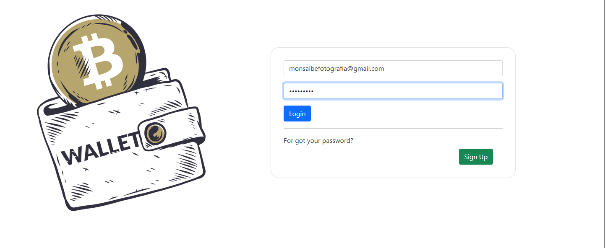
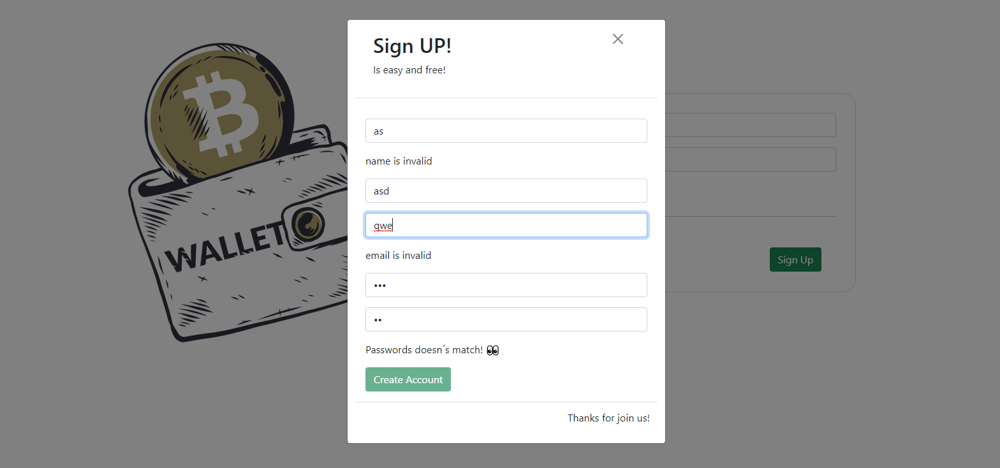
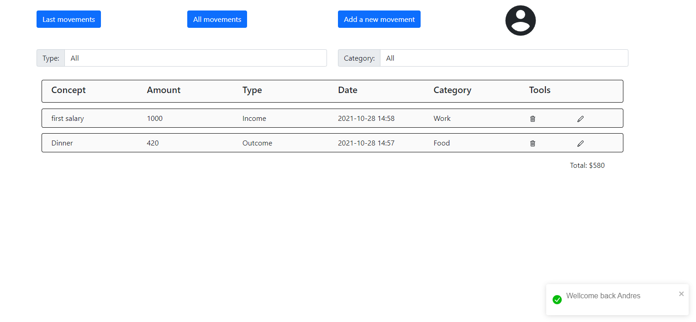
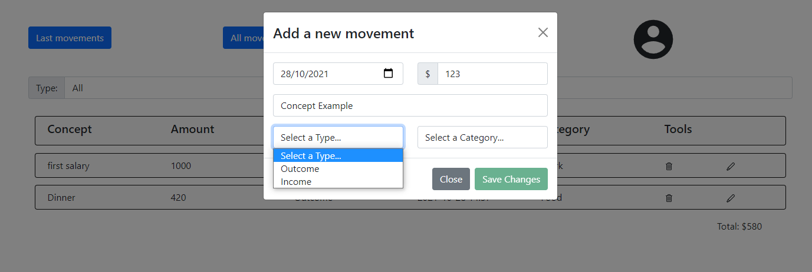
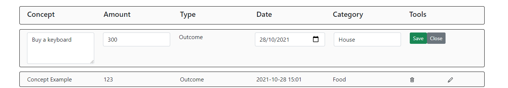
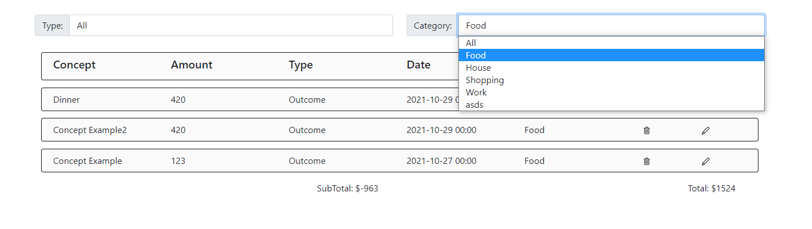
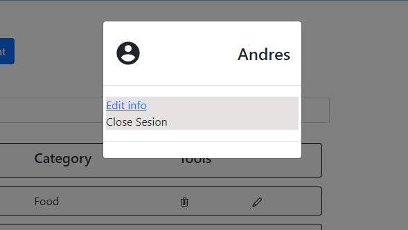

## Wellcome to mywalletflow app! 
- A site developed for the Alkemy.org bootcamp challenge, but which continues to be developed as part of a learning process.

  

 

- Users can login or register if they don't have an account.

  

 

- Once logged in you can see all your movements and a balance .

  

- You can add a movement too! It´s esasy, you only have to choose a date, amount, concept name, type (outcome/income) and a movement category. 

  

- If you want, you can modify any movement clicking in the pencil icon.

  

- You can filter by Category and Type .

  

- You can close sesion and  You will able to edit profile .

  

> Made using the HTML, CSS, Javascript, React, Redux, Node.JS, Express, Bootstrap Sequelize, PostgreSQL technology stack.
 
> Toasts =>  https://www.npmjs.com/package/react-toastify.

